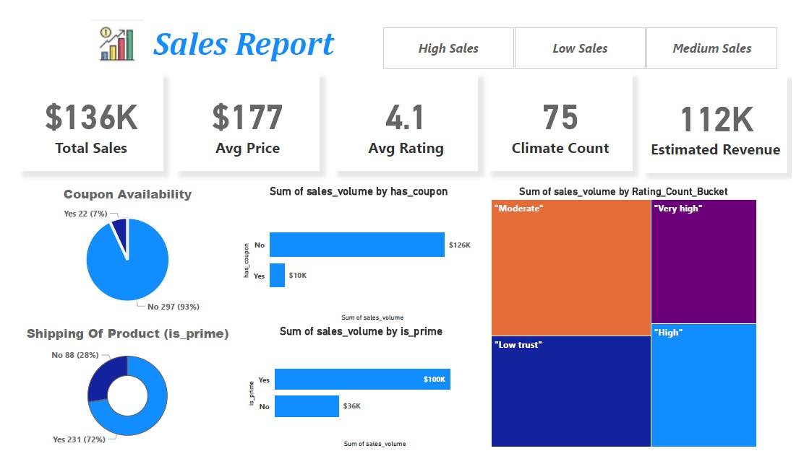
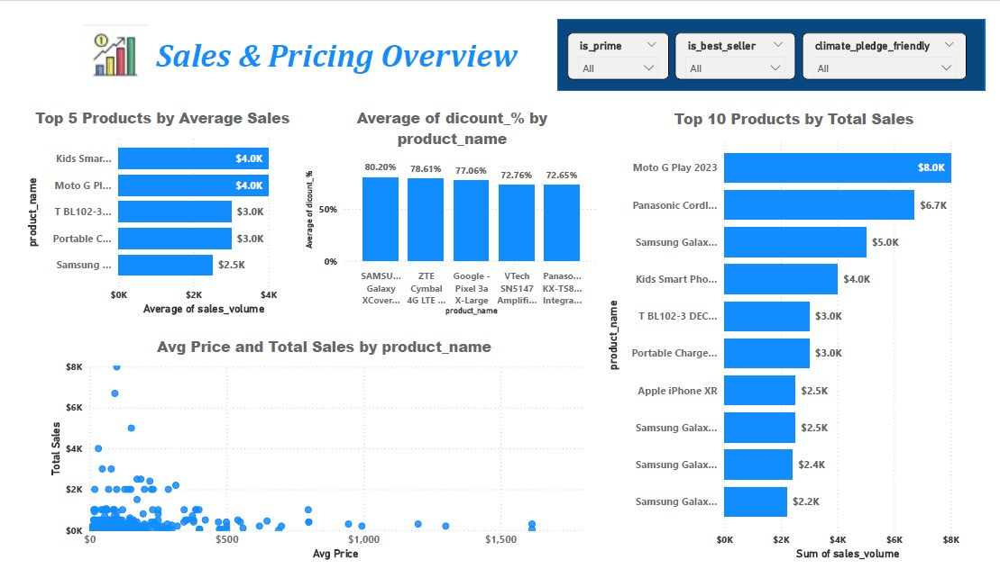
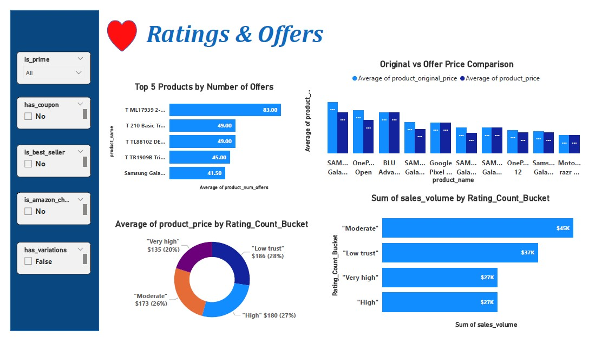

# Sales & Pricing Report Dashboard

## 1. Project Overview

**Objective:**
The goal of this project is to analyze product sales data (mainly smartphones) from **Amazon** using **Power BI**.
The analysis focuses on pricing, sales, discounts, ratings, and offers, with the creation of an interactive dashboard that displays **Key Performance Indicators** (KPIs) related to this data.

## 2. Tools Used

- **Power BI**: Used for loading, cleaning the data, and creating visualizations and the final dashboard.
- **Excel/CSV**: The data was loaded from a CSV file containing product information such as price, rating, offers, sales volume, and more.

## 3. Data Cleaning and Transformation Steps

1. **Loading Data**:

   - Data was loaded from a CSV file containing various fields such as:
     - `product_title`, `product_price`, `product_star_rating`, `product_num_ratings`, `product_num_offers`, `sales_volume`, etc.

2. **Data Cleaning**:

   - Some columns were converted into **True/False** or **Yes/No** (e.g., `is_best_seller`, `has_coupon`, `is_prime`).
   - Missing values were filled based on **logical** replacement (e.g., filling `product_original_price` and `product_minimum_offer_price` with `product_price`).
   - Some columns like `product_num_ratings` were classified into buckets like:
     - "Low Trust", "Moderate", "High", "Very High" based on the number of ratings.

3. **Handling Missing Values**:
   - Columns with missing values were identified and handled either by **filling** or **removing** the rows (based on the necessity).
   - **Data Types** for each column were verified (e.g., `Decimal` for prices and `Whole Number` for counts).

## 4. Analysis Performed

1. **DAX Measures**:

   - Several DAX measures were created to calculate key KPIs such as:
     - **Total Sales**
     - **Avg Price**
     - **Avg Rating**
     - **Avg Discount %**
     - **Climate Friendly %**

2. **Distribution Analysis**:
   - **Bar Charts** and **Pie Charts** were used to analyze the distribution of products by:
     - **Coupons** (Whether there are coupons available or not)
     - **Availability** (In Stock / Limited / Out of Stock)
     - **Ratings** (Low Trust / Moderate / High / Very High)

## 5. Dashboard Design

- **Page 1: KPIs Overview**:

  - **Cards** displaying the key measures: `Total Sales`, `Avg Price`, `Avg Rating`, `Climate Friendly %`.
  - **Pie Chart** showing the percentage of products with and without a coupon.
  - **Bar Charts** analyzing sales by product with slicers for filtering.

- **Page 2: Sales & Pricing Report**:

  - **Bar Charts** analyzing sales by product.
  - **Column Charts** comparing the original price with the offer price.
  - **Slicers** for filtering by offers, coupons, or availability.

- **Page 3: Ratings & Offers Report**:
  - **Top Products by Number of Offers**: Analyzing products with the highest number of offers.
  - **Average Discount %**: Analyzing the average discount percentage per product.
  - **Top Products by Total Sales**: Comparing the highest selling products.

## 6. Results and Final Insights

- **Top Products**: The **Top 10 Products by Total Sales** and **Top 5 Products by Average Sales** help identify the most profitable products.
- **Offer Interaction**: Products with offers tend to sell more, while products offering higher discounts perform better in sales.
- **Ratings Distribution**: Products with higher ratings tend to drive more sales, while products with lower ratings need improvement.

## Additional Notes:

- **Slicers** were provided for filtering products by discounts, offers, and availability.
- **Flexibility in visualization**: The dashboard can easily be adjusted to suit future needs by adding more filters or charts.

